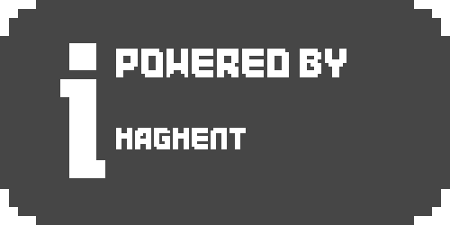

# Silver C++
## Graphics implemented with emojis

<a href="https://github.com/imagment">
  
</a>


Silver C++ is a header file that makes your console games/applications better!

- Achievements
- Item & Inventory management
- Translation
- Graphics using emojis
- Easier programming
- And more!

## Header files (Can be included by including silver.hpp)

To get information about each header file, see documents of those header files
- achievements.h
- inventory.h
- prefs.h
- programming.h
- prompt.h
- markdowns.h
- music.h
- game.h

```
#include "silver.hpp"
```
